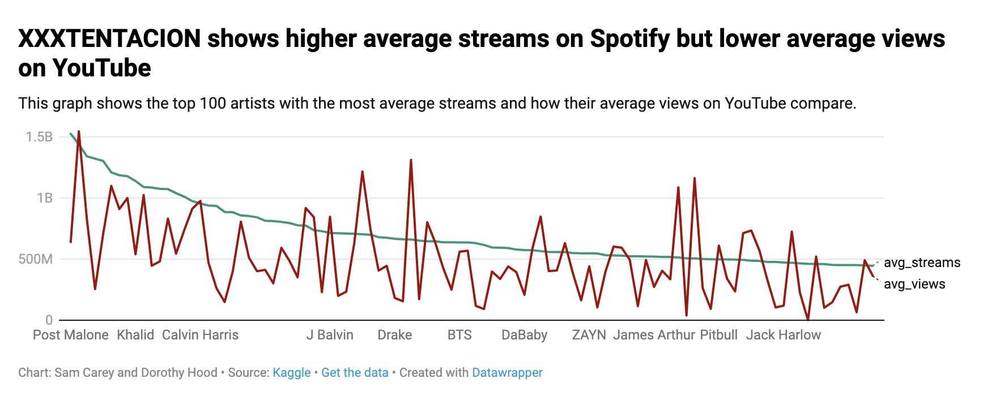
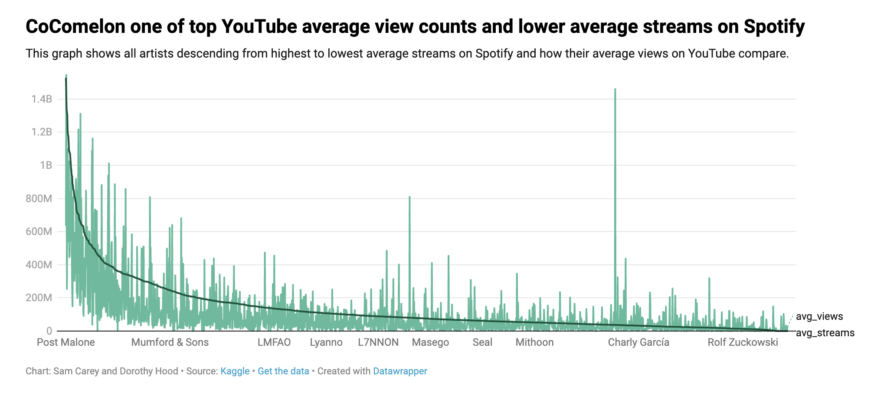

```{r setup, include=FALSE}
knitr::opts_chunk$set(echo = TRUE)
```

## Introduction

In this notebook, we are analyzing data from Spotify and YouTube on artists and their top 10 songs found here: https://www.kaggle.com/datasets/salvatorerastelli/spotify-and-youtube

## Load Libraries

```{r echo=FALSE, message=FALSE}
library(tidyverse)
library(lubridate)
library(janitor)
```

## Load and Clean Data

```{r}
# Load data and clean it

spotify_youtube <- read_csv("data/Spotify_Youtube.csv")
  cleaned_spotify_and_youtube <- spotify_youtube %>%
  clean_names() 
  
```

## Exploratory Analysis

1. In our data set, it seems that there are 28 columns and 20,718 rows. In this case, a lot of information!

2. The data includes various artists' top 10 songs and their information on Spotify and YouTube, including streams, URLs, albums and more. There is also data on each songs' danceability, energy, loudness, and more. 

## Limitations and Flaws

1. The first column, labeled "x1," lists out the artists' top 10 songs in number from zero to nine. For example, 0 to 9 in the data set count 10 songs by Gorillaz. It does this all the way down the data set, continuing with 10-19, then 20-29, etc. 

We thought this was a bit of an organizations flaw as first, there is no accurately-titled column name, and starting a count of 10 from zero to nine is a bit off to the eye. We could get rid of that column but I think it's nice to see an ordered list for each artist. What we can do is rename the column, which we think could be something like "artist_10_songs_listed." 

```{r}
cleaned_spotify_and_youtube <- cleaned_spotify_and_youtube %>%  
  rename(artist_10_songs_listed = x1)
```

2. The data under "album_type" either shows if a song is part of an album,a single or a compilation. We think the column name should reflect that better than being called "album_type" as that doesn't necessarily mean single or compilation. 

3. The "duration_ms" column lists out all of the songs' lenghts in milliseconds, which is a bit inconvenient to look at versus seeing the length in minutes and seconds. We think we can make this easier by dividing each value in that column by 60,000 (60,000 milliseconds in a minute) and adding a new column to see that length in minutes. 

4. There are some N/A's in the stream column which doesn't make sense since there is a YouTube link. When you check the songs on YouTube, like the "Best Friend (Remix)" by 50 Cent, it shows a view count. 

```{r}
cleaned_spotify_and_youtube <- cleaned_spotify_and_youtube %>% 
  mutate(duration_minutes = duration_ms/60000)
```

There are now 29 columns, and it seems some of the values didn't carry over another minute (some say > 60 seconds like 3.71 for the first song for example). Maybe we can figure out a way to specify this further. 

## Other Limits in Timeframe, What is and isn't Included, Definitions, etc.

1. The data notes on Kaggle mention that the data is heavily dependent on when it was collected, being Feb. 7, 2023. It also says at the top that the data page was updated 25 days ago. Obviously, songs will be streamed and listened to and have been after Feb. 7, so the numbers are probably a bit different. 

2. It's interesting to note that only likes are counted in this data and not dislikes, because many songs do have dislikes that could be significant. 

3. The data from danceability to tempo, they are all studied on a scale to provide a number to show, for example, how loud, or not loud, a song is. (Under "loudness"). The data on Kaggle lists what the numbers could mean when it comes to more or less of something, and what's considered when choosing the number. However, there isn't any calculation or explanation on how these numbers are reached. For "Key," the integers match to pitches in Pitch Class notation. We aren't super familiar with what that means so it definitely requires some research. 

To better define some of these, the information listed under each column on Kaggle does provide some insight so we can better understand where it comes from. For example, "liveness" detects the presence of an audience in the recording. 

## Does this data answer our questions?

1. How does this data compare to users who don’t watch the videos of certain songs, or use another platform that isn’t Spotify, like Apple Music?

As mentioned in notes by Professor Willis and our own data given, we can't use the data to compare Spotify and Apple Music since we only have data for Apple Music. So, we can compare YouTube and Spotify instead. We can use the amount of views on YouTube to the amount of streams on Spotify and see if more people use one platform over another, or use them the same amount.

2. Should there be a place to show the number of streams each song/video has?

As mentioned by Professor Willis and after looking at our data, our data frame doesn't help us answer this question. We decided to change this question but are stuck between two options. One would be: What artist/s has the most views/streams on Spotify and YouTube? We can use the data for this. The second question could be: Do songs that are not licensed and not official videos gets less views on YouTube? We can see this through the data as well.

3-5. These questions we can use the data to compare Spotify streams and YouTube views for songs, calculate totals and research artists' ages. We can even use Datawrapper for these to study the trends of longer or shorter songs and more or less dance-able and high/low energy songs to see the differences in popularity. 


## Any more cleaning of data based off notes from Professor Willis
1. We would like to add a seconds column to show the length of the music as well. We will do that below.
```{r}
cleaned_spotify_and_youtube - cleaned_spotify_and_youtube %% 
  mutate(duration_seconds = duration_ms/1000)
```
## Questions we attempted to answer

1. Do artists with more views/streams on average have songs that have similar characteristics represented in the data? 

## Narrative for question
Our original question, "What songs have the most streams on YouTube and Spotify and are they older or younger artists?" did not work in this project as we can't grasp this information from the data, and we could do more with the streams and views. This new question will observe average Spotify streams and YouTube views the artists have on their top 10 songs, and we will try to figure out if they show similar characteristics in the data that led to these top streams/views. 

**A** To get this answer, we made two new dataframes to reveal total views/streams for each artist on both platforms and divide them by the number of songs listed in the dataframe (10). From there, we arranged each list by the averages per artist from most to least. 

After quickly glancing at both dataframes, we noticed that the lists seem to differ pretty largely from Spotify to YouTube. The top ten artists with the biggest average streams on Spotify, starting with #1, is Post Malone, Ed Sheeran, Dua Lipa, XXXTENTACION, The Weeknd, Justin Bieber, Imagine Dragons, Coldplay, Khalid and Bruno Mars. The top ten artists with the biggest average views on YouTube, starting with #1, is Ed Sheeran, CoComelon, Katy Perry, Charlie Puth, Luis Fonsi, Justin Bieber, Daddy Yankee, Bruno Mars, Macklemore & Ryan Lewis and Coldplay. 

It's clear here that some artists do repeat in each list, like Justin Bieber, Coldplay and Ed Sheeran. Top average streams on Spotify is 1,525,126,385 whereas top average views on YouTube is 1,546,020,777. YouTube seems to cover a bit more ground in average streams/views area, but not by much. A question we can ask from this is, "Why are some artists getting more streams on Spotify and not on YouTube?" or "Why are some artists getting more views on YouTube and not on Spotify?"

We think it's important to note that towards the bottom of both of these dataframes, there is no data for total views/streams for some artists, shown with "N/A." We wonder why this is. 

We now compared the top three artists on both dataframes to one another to see if characteristics line up that result in these higher streams/views. The top three artists on Spotify are Post Malone, Ed Sheeran and Dua Lipa. We created a dataframe to calculate averages of many of the characteristics included in the original dataframe, like danceability, valence, etc. Looking at them all together, it seems these three artists have similar danceability, about 0.7, energy at about 0.6-0.7, key from about 4.7-5.7 and loudness at about -4 to -5. It seems these could possibly be characteristics that lead to more streams on Spotify and popularity as an artist in general. These three artists also do fit in to the pop genre. We think it could have something to do with genre.

We now compare the top three artists on YouTube, Ed Sheeran, CoComelon and Katy Perry. These three don't seem to have as many similar as did the top three artists on Spotify. These three have similar danceability at around 0.7 and speechiness at around 0.04-0.05. CoComelon isn't an artist, it's a children's show. 

To check to see if this trend continued with more streams/views and higher danceability, we compared the top 50, 100, 500 and 100 artists' danceability scores and streams/views for Spotify and YouTube. We did this to check and see if the top 10, or top 3, were just outliers or representative not of the entire dataframe. Below, we used code to graph the top 1000 artists, their danceability and streams/views to see an overall trend. 

For the top 1000 artists and stream counts on Spotify, it seems many songs fall under the range of 0.50 to 0.75 on the danceability scale. As it reaches that range, the songs seem to make an arch increase to around 2,000,000,000 (2 billion) streams. We also do see two outliers above 3,000,000,000 (3 billion) streams. There doesn't seem to be a huge trend or increase in streams as danceability increases, but it seems more clear compared to the top 1000 artists and view counts on YouTube. On the scatterplot for YouTube, the range for danceability seems to be 0.6 to 0.8 where most artists' videos lie. In this plot, we don't see much of an arch of increase, but we do see about 5 outliers that reach above 4 billion views and one even reaching close to 8 billion. Then, we compared these plots to ones of the entire dataframe.

In these two scatterplots, we can clearly see some sort of increase in the streams and views of the songs as the danceability score goes up. Both have a slow, gradual buildup as you move towards higher danceability scores. There are also clearly several outliers for each plot, so it is beneficial that we compared a sample of the data and the whole dataframe. It's importan to note that as danceability gets really high, the view and stream counts start to gradually drop, so the data makes a bit of an arch shape. It seems that as danceability increases, the stream and view count do show a gradual increase as well. 

Overall, it seems that for both Spotify and YouTube, danceability seems to take a strong role in popularity and views/streams for an artist. 

```{r}
# Sam re-coded for this question to:
# First, finding the top artists with streams on Spotify

top_artists_spotify <- cleaned_spotify_and_youtube %>% 
  group_by(artist) %>% 
  summarise(total_streams = sum(stream)) %>%
  mutate(avg_streams = total_streams/10) %>% 
  arrange(desc(avg_streams)) %>% 
  select(artist, total_streams, avg_streams)

# Second, finding the top artists with views on YouTube

top_artists_youtube <- cleaned_spotify_and_youtube %>% 
  group_by(artist) %>% 
  summarise(total_views = sum(views)) %>% 
  mutate(avg_views = total_views/10) %>% 
  arrange(desc(avg_views)) %>% 
  select(artist, total_views, avg_views)

# Compare artists

top_three_spotify <- cleaned_spotify_and_youtube %>% 
  filter(artist %in% c("Post Malone", "Ed Sheeran", "Dua Lipa")) %>% 
  group_by(artist) %>% 
  summarise(total_dance = sum(danceability), 
            total_energy = sum(energy), 
            total_tempo = sum(tempo), 
            total_key = sum(key), 
            total_loudness = sum(loudness), 
            total_speech = sum(speechiness), 
            total_acoust = sum(acousticness), 
            total_instru = sum(instrumentalness), 
            total_live = sum(liveness), 
            total_valence = sum(valence)) %>% 
  mutate(avg_dance = total_dance/10,
         avg_energy = total_energy/10, 
         avg_tempo = total_tempo/10, 
         avg_key = total_key/10, 
         avg_loudness = total_loudness/10, 
         avg_speech = total_speech/10, 
         avg_acoust = total_acoust/10, 
         avg_instru = total_instru/10, 
         avg_live = total_live/10, 
         avg_valence = total_valence/10)

top_three_YouTube <- cleaned_spotify_and_youtube %>% 
  filter(artist %in% c("Ed Sheeran", "CoComelon", "Katy Perry")) %>% 
  group_by(artist) %>% 
  summarise(total_dance = sum(danceability), 
            total_energy = sum(energy), 
            total_tempo = sum(tempo), 
            total_key = sum(key), 
            total_loudness = sum(loudness), 
            total_speech = sum(speechiness), 
            total_acoust = sum(acousticness), 
            total_instru = sum(instrumentalness), 
            total_live = sum(liveness), 
            total_valence = sum(valence)) %>% 
  mutate(avg_dance = total_dance/10,
         avg_energy = total_energy/10, 
         avg_tempo = total_tempo/10, 
         avg_key = total_key/10, 
         avg_loudness = total_loudness/10, 
         avg_speech = total_speech/10, 
         avg_acoust = total_acoust/10, 
         avg_instru = total_instru/10, 
         avg_live = total_live/10, 
         avg_valence = total_valence/10)

# Compare top 50/100/500/1000 for danceability on Spotify

top_50_d <- cleaned_spotify_and_youtube %>% 
  select(track, danceability, stream) %>% 
  arrange(desc(stream)) %>% 
  head(50)

top_100_d <- cleaned_spotify_and_youtube %>% 
  select(track, danceability, stream) %>% 
  arrange(desc(stream)) %>% 
  head(100)

top_500_d <- cleaned_spotify_and_youtube %>% 
  select(track, danceability, stream) %>% 
  arrange(desc(stream)) %>% 
  head(500)

top_1000_d <- cleaned_spotify_and_youtube %>% 
  select(track, danceability, stream) %>% 
  arrange(desc(stream)) %>% 
  head(1000)

# Now for YouTube

top_50_d_you <- cleaned_spotify_and_youtube %>% 
  select(track, danceability, views) %>% 
  arrange(desc(views)) %>% 
  head(50)

top_100_d_you <- cleaned_spotify_and_youtube %>% 
  select(track, danceability, views) %>% 
  arrange(desc(views)) %>% 
  head(100)

top_500_d_you <- cleaned_spotify_and_youtube %>% 
  select(track, danceability, views) %>% 
  arrange(desc(views)) %>% 
  head(500)

top_1000_d_you <- cleaned_spotify_and_youtube %>% 
  select(track, danceability, views) %>% 
  arrange(desc(views)) %>% 
  head(1000)

# Danceability and Stream/Views on scatterplot for top 1000 Spotify and YouTube

ggplot(top_1000_d, aes(x = danceability, y = stream)) +
  geom_point(color = "blue", size = 0.5) +
  labs(title = "With a higher danceability, there are more streams on Spotify",
       x = "Danceability",
       y = "Streams") +
  theme_bw()

ggplot(top_1000_d_you, aes(x = danceability, y = views)) +
  geom_point(color = "blue", size = 0.5) +
  labs(title = "Many videos on YouTube range from 0.6 to 0.8 for danceability",
       x = "Danceability",
       y = "Views") +
  theme_bw()

# Danceability and Stream/Views on a scatterplot 

ggplot(cleaned_spotify_and_youtube, aes(x = danceability, y = stream)) +
  geom_point(color = "blue", size = 0.5) +
  labs(title = "With a higher danceability, there are more streams on Spotify",
       x = "Danceability",
       y = "Streams") +
  theme_bw() 

ggplot(cleaned_spotify_and_youtube, aes(x = danceability, y = views)) +
  geom_point(color = "blue", size = 0.5) +
  labs(title = "With a higher danceability, there are more views on YouTube",
       x = "Danceability",
       y = "Views") +
  theme_bw() 

```

2. Do shorter or longer songs gain more traction or popularity? 

## Narrative for question
For this question, we were advised to consider much more of the dataframe versus the top 10 songs, as we are given the durations for all 20,718 songs. We were advised to see if there was some sort of cutoff where songs wouldn't reach a certain number of streams or views depending on how long the song is. We attempted to answer these questions by making two separate data frames of the streams for each song on Spotify and for YouTube, and then taking the top 10, 50 and 100 songs stream wise and view wise and pulled them into separate dataframes to see if we could recognize a trend of length of song versus stream/view count. 

**A**
On Spotify, the top 10 songs are Blinding Lights, Shape of You, Someone You Loved, rockstar (feat. 21 Savage), Sunflower - Spider-Man: Into the Spider-Verse (listed twice), One Dance, Closer (listed twice) and Believer. The top 10 Youtube videos are, Luis Fonsi - Despacito ft. Daddy Yankee (listed twice), Shape of You, See You Again ft. Charlie Puth (listed twice), Wheels on the Bus | CoComelon Nursery Rhymes, Uptown Funk ft. Bruno Mars, Gangnam Style (강남스타일), Sugar and Roar. 

The top 10 songs on Spotify have lengths ranging between 3 to 4 minutes, with more in the 3 minute range, and the top 10 songs on YouTube have lengths ranging between 3 to 4 minutes as well, with more settling in the 4 minute range. This is interesting to note, because many time music videos tend to be a bit longer to provide more context or story to the song, versus Spotify where the song just plays. Clearly here, the songs are on the shorter side. 

According to an article by University Times, "every year, seconds of songs are being shaved off: Justin Timberlake’s “Cry Me A River” released in 2002 is five minutes long, while “Love The Way You Lie” by Rihanna and Eminem, released in 2010, is over four. By comparison, “Mood” by 24kGolden, which, at the time of writing, sits at the top of the Global Spotify charts is only two minutes and 20 seconds long." 

Based on this alone, we can see that shorter songs attract more streams because of societies shortening attention spans. The article compared it to podcasts, and how people are now requesting 15 minute podcasts. 

Now, when studying the whole list of songs, their streams/views, and duration, it is a bit difficult to pinpoint an exact cutoff where views or streams stop depending on the length of the songs. So, we studied the top 100 songs and tried to reach some sort of conclusion. The longest songs on Spotify within the top 100 range from 5 to 6 minutes, and for YouTube 5 to 10 minutes. YouTube shows a lot bigger of a range, and that could be due to its visual aspects and storyline. We believe past those ranges, streams and views begin to drop, while also noting there are many shorter songs that range in the 1 to 2 minutes that are within the top 100. The most common range for popularity lies between 3 and 4 minutes, which is on the shorter side. 

We created two scatterplots to show the trend of length of songs in milliseconds and the stream and view counts. In these two plots, we can clearly see a trend of when songs are on the shorter side, there is a quick and steep increase in stream/view count. For both, it seems that songs reach their peak views/streams at a little less than 250,000 milliseconds, or a little under 4 minutes in length. After it hits 250,000 milliseconds, the number of streams and views seem to drop off and decrease. 

Overall, it seems that shorter songs do attract more popularity, and that length does influence popularity of artists' songs.

What's interesting to not and what could be conflicting our data is duplicates of many songs when they have features, because they show them for both artists. Also, there are songs that have N/A values for both streams and views. We wonder why the data has these values.  

To make a story from this data, we could ask questions like, why do people like listening to shorter songs? Does it involve short attention spans? Do people like listening to shorter songs on Spotify but watching the videos that may be longer? What draws them to longer videos? This would require some more research and interviewing those with musical expertise and also people who listen to music.


```{r}
# Sam found the top songs on Spotify and Youtube, now let's separate by length of songs
length_spotify <- cleaned_spotify_and_youtube %>% 
  group_by(track, stream, duration_ms) %>% 
  summarize(count = n()) %>% 
  arrange(desc(duration_ms))

top_10 <- cleaned_spotify_and_youtube %>% 
  select(track, duration_ms, stream) %>% 
  arrange(desc(stream)) %>% 
  head(10)

top_50 <- cleaned_spotify_and_youtube %>% 
  select(track, duration_ms, stream) %>% 
  arrange(desc(stream)) %>% 
  head(50)

top_100 <- cleaned_spotify_and_youtube %>% 
  select(track, duration_ms, stream) %>% 
  mutate(minutes = duration_ms/60000) %>% 
  arrange(desc(stream)) %>% 
  head(100)

# Filter for YouTube views
length_youtube <- cleaned_spotify_and_youtube %>% 
  group_by(track, views, duration_ms) %>% 
  summarise(count = n()) %>% 
  arrange(desc(duration_ms)) %>% 
  select(duration_ms, track)

top_10_y <- cleaned_spotify_and_youtube %>% 
  select(track, duration_ms, views) %>% 
  arrange(desc(views)) %>% 
  head(10)

top_50_y <- cleaned_spotify_and_youtube %>% 
  select(track, duration_ms, views) %>% 
  arrange(desc(views)) %>% 
  head(50)

top_100_y <- cleaned_spotify_and_youtube %>% 
  select(track, duration_ms, views) %>% 
  mutate(minutes = duration_ms/60000) %>% 
  arrange(desc(views)) %>% 
  head(100)

# Scatterplot

ggplot(cleaned_spotify_and_youtube, aes(x = duration_ms, y = views)) +
  geom_point(color = "blue", size = 1) +
  labs(title = "The most views occur a little before 250,000 milliseconds",
       x = "Duration in Milliseconds",
       y = "Views") +
  theme_bw() + 
  xlim(0, 1000000) +
  ylim(0, 2000000000)

ggplot(cleaned_spotify_and_youtube, aes(x = duration_ms, y = stream)) +
  geom_point(color = "blue", size = 1) +
  labs(title = "The most streams occur a little before 250,000 milliseconds",
       x = "Duration in Milliseconds",
       y = "Streams") +
  theme_bw() + 
  xlim(0, 1000000) +
  ylim(0, 2000000000)

```

3. Does the danceability and energy of a song affect its popularity?

**A**

```{r}

```

4. Do songs that are not licensed and not official videos gets more or less views on YouTube compared to those that are licensed or official videos?

**A**

```{r}

```

5. Do more people listen to music through Spotify or YouTube? 

## Narrative for question
We decided to include this question as a replacement for a question dating back to milestone_01. Since we can't compare data from Apple Music to Spotify or YouTube because the dataframe doesn't include it, we will compare Spotify and YouTube. To do this, we summed up the total views YouTube received in this dataframe and how many total streams Spotify has in the dataframe.

**A** In total, YouTube, from this dataframe, has a view count of 1,902,053,002,307. In total, Spotify has a stream count of 2,738,147,598,694. As we can see here, Spotify has gathered more traction from these songs and artists compared to YouTube. 

The question is, how accurate is this? There are many songs that contain N/A values for streams and views, which is why we added "na.rm = TRUE" to the code below. Would these values of swayed to one side of the other, or made it more equal? These two big numbers, in the trillions, are pretty close to each other. 

For this question, we're wondering anything else we can tap into or research the difference between the usage of these two platforms. Both are similar and different in their own ways, where YouTube is a ground for more video content and Spotify for solely music. Do people like listening more than watching?

**WILL BE WRITING MORE**

Line graph of top 100 artists listed by most to least average streams: https://www.datawrapper.de/_/fuUWV/  

Line graph of all artists listed by most to least average streams: https://www.datawrapper.de/_/Fzobp/ 

```{r}
# Comparing total views and streams

total_views_and_streams <- cleaned_spotify_and_youtube %>% 
  summarise(total_views = sum(views, na.rm = TRUE), 
            total_streams = sum(stream, na.rm = TRUE)) %>% 
  select(total_views, total_streams)

# Dataframe with all stats and STREAMS ONLY

streams_and_stats <- select(cleaned_spotify_and_youtube, -views, -url_youtube, -title, -channel, -likes, -comments, -description, -licensed, -official_video)

streams_and_stats <- streams_and_stats %>% 
  group_by(artist) %>% 
  summarise(total_streams = sum(stream),
            total_dance = sum(danceability), 
            total_energy = sum(energy), 
            total_tempo = sum(tempo), 
            total_key = sum(key), 
            total_loudness = sum(loudness), 
            total_speech = sum(speechiness), 
            total_acoust = sum(acousticness), 
            total_instru = sum(instrumentalness), 
            total_live = sum(liveness), 
            total_valence = sum(valence)) %>% 
  mutate(avg_streams = total_streams/10,
         avg_dance = total_dance/10,
         avg_energy = total_energy/10, 
         avg_tempo = total_tempo/10, 
         avg_key = total_key/10, 
         avg_loudness = total_loudness/10, 
         avg_speech = total_speech/10, 
         avg_acoust = total_acoust/10, 
         avg_instru = total_instru/10, 
         avg_live = total_live/10, 
         avg_valence = total_valence/10) %>% 
  select(-starts_with("total_")) %>% 
  arrange(desc(avg_streams))

# Dataframe with all stats and VIEWS ONLY

views_and_stats <- select(cleaned_spotify_and_youtube, -stream, -url_spotify, -track, -album, -album_type, -uri)

views_and_stats <- views_and_stats %>% 
  group_by(artist) %>% 
  summarise(total_views = sum(views),
            total_dance = sum(danceability), 
            total_energy = sum(energy), 
            total_tempo = sum(tempo), 
            total_key = sum(key), 
            total_loudness = sum(loudness), 
            total_speech = sum(speechiness), 
            total_acoust = sum(acousticness), 
            total_instru = sum(instrumentalness), 
            total_live = sum(liveness), 
            total_valence = sum(valence)) %>% 
  mutate(avg_views = total_views/10,
         avg_dance = total_dance/10,
         avg_energy = total_energy/10, 
         avg_tempo = total_tempo/10, 
         avg_key = total_key/10, 
         avg_loudness = total_loudness/10, 
         avg_speech = total_speech/10, 
         avg_acoust = total_acoust/10, 
         avg_instru = total_instru/10, 
         avg_live = total_live/10, 
         avg_valence = total_valence/10) %>% 
  select(-starts_with("total_")) %>% 
  arrange(desc(avg_views))

# Average streams and views of top 100 artists with highest average streams

avg_streams_and_views <- cleaned_spotify_and_youtube %>% 
  group_by(artist) %>% 
  summarise(total_views = sum(views, na.rm = TRUE), 
            total_streams = sum(stream, na.rm = TRUE)) %>%
  mutate(avg_views = total_views/10,
         avg_streams = total_streams/10) %>% 
  arrange(desc(avg_streams)) %>% 
  select(-starts_with("total_")) %>% 
  head(100)

write.csv(avg_streams_and_views, "data/avg_streams_and_views.csv", row.names = TRUE)

# Average streams and views of all artists listed by most to least average streams

avg_streams_and_views_all <- cleaned_spotify_and_youtube %>% 
  group_by(artist) %>% 
  summarise(total_views = sum(views, na.rm = TRUE), 
            total_streams = sum(stream, na.rm = TRUE)) %>%
  mutate(avg_views = total_views/10,
         avg_streams = total_streams/10) %>% 
  arrange(desc(avg_streams)) %>% 
  select(-starts_with("total_")) 

write.csv(avg_streams_and_views_all, "data/avg_streams_and_views_all.csv", row.names = TRUE)
```

```{r, echo=FALSE}
# Graph one of top 100 artists with highest average streams 


# Graph of all artists listed by most to least average streams

```

## What is our most newsworthy find and why?

**A** We think our most newsworthy find out of these questions is that shorter songs tend to grasp more views/streams/popularity. Why? We think because it can tap into a much deeper study and story findings than simply off of this dataframe.

We can see from here that shorter songs gain more traction. Could this be because of short-attention spans? Why are short attention spans occurring? What age bracket/generation tends to have shorter attention spans? How does this effect music. We can see this in the article we found for that question that artists now aim to make shorter songs, but many still do exceed expectations with longer songs that speak to their talent and willingness to tell a story. 

We can dig further here. Social media has been an influence on shorter attention spans, especially TikTok. TikTok bases a lot of their content on music! Many songs that are older or recently released grow more in popularity because TikTok users become infatuated with one lyric or beat and search the songs to listen to them, increasing streams and views. Many artists have had one-hit wonders because of this. 

All of these pieces tie in to one another, which we think would be a great story that would attract artists and a range of ages for readers to see effects on popularity of music due to many characteristics like length and short attention spans. 
